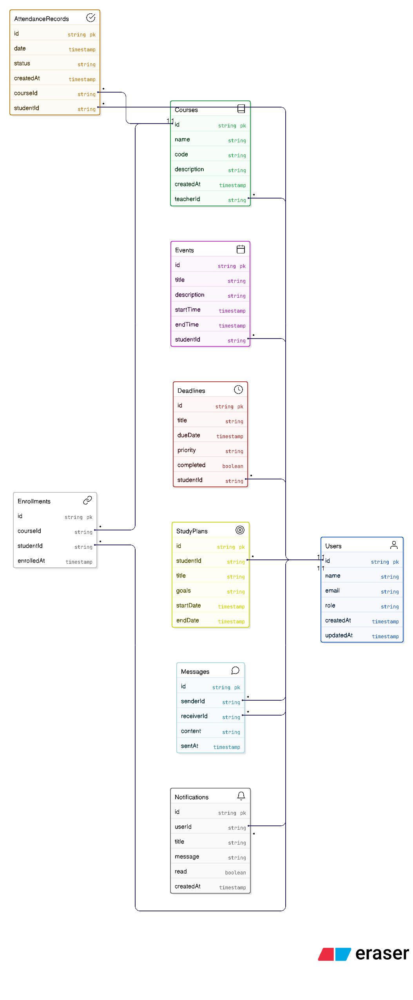

# ER Diagram
The ER Diagram represents the database structure of the  platform.  
Since the system uses MongoDB, the entities are modeled as collections rather than traditional relational tables.  
The diagram highlights how user data, academic records, schedules, and communication modules are interconnected.

The goal of this data model is to maintain flexibility, scalability, and efficient retrieval of academic insights while supporting personalized planning and predictive analytics.

## Key Relationships
- A **User** can have multiple **Notifications** and **Messages**.
- A **Student** enrolls in multiple **Courses**.
- A **Course** contains multiple **Attendance Records**.
- A **Student** can have multiple **Events**, **Deadlines**, and **Study Plans**.
- **Attendance Records** link Students with Courses.
- **Messages** and **Notifications** are associated with Users.

## Diagram

