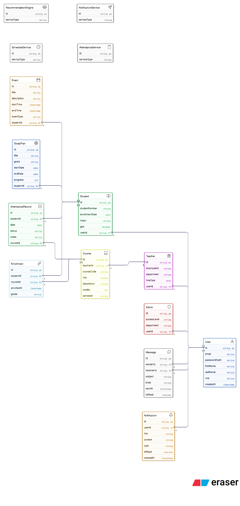

# Class Diagram

This illustrates the major domain entities, their attributes, methods, and relationships along with supporting service classes responsible for system logic.

The diagram demonstrates inheritance, associations, and service-layer abstraction to maintain modularity and scalability in backend architecture.

## Key Design Concepts
- **Inheritance:** Student, Teacher, and Admin extend the base User class.
- **Encapsulation:** Each class maintains its own attributes and behavior.
- **Abstraction:** Service classes handle business logic separately from domain entities.
- **Associations:** Students interact with courses, events, attendance records, and study plans.
- **Composition:** Notifications and messages are tightly linked to users.

## Diagram

