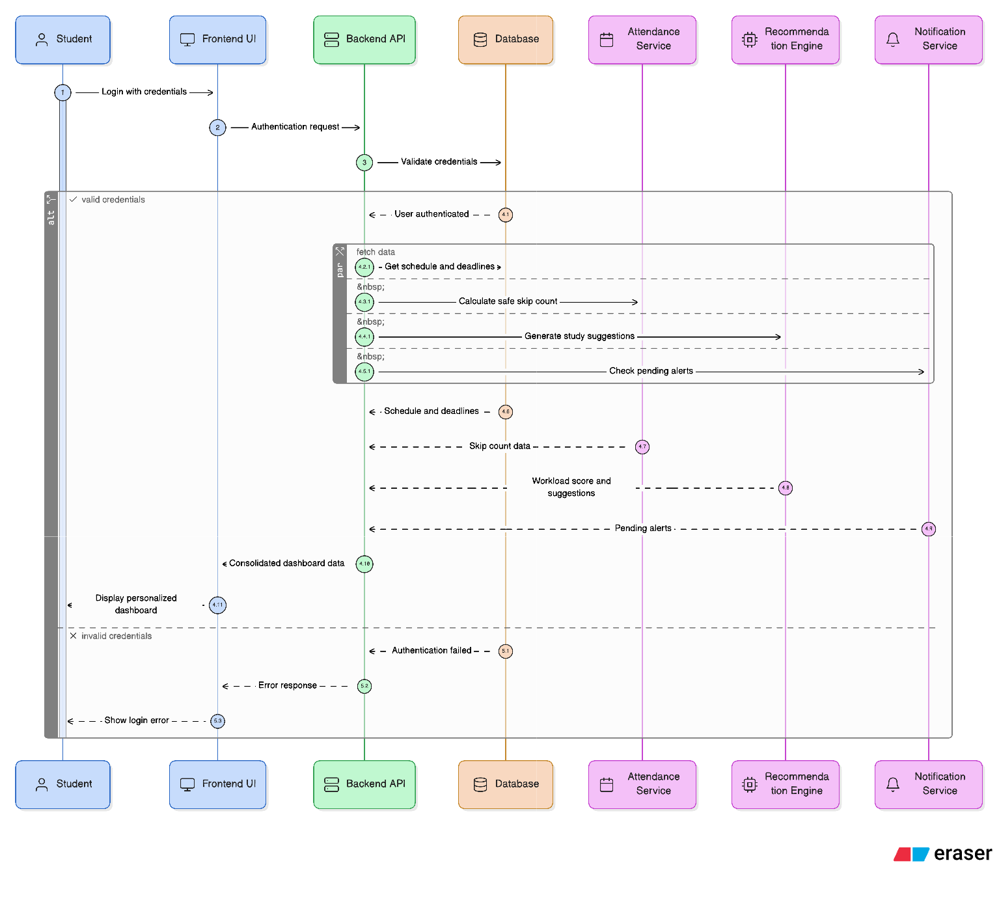

# Sequence Diagram

The Sequence Diagram represents the primary end-to-end interaction flow within the Zync platform when a student accesses their personalized dashboard. This flow demonstrates how multiple backend services collaborate to deliver predictive insights, attendance guidance, workload analytics, and notifications in real time.

The diagram highlights the interaction between the frontend interface, backend APIs, analytical engines, and the database to ensure a seamless and intelligent academic planning experience.

## Main Flow Description
1. Student logs into the platform.
2. Frontend sends authentication request to Backend API.
3. Backend validates credentials with MongoDB database.
4. Backend retrieves schedule, attendance records, deadlines, and extracurricular events.
5. Attendance Service computes attendance percentage and safe skip calculations.
6. Recommendation Engine generates study and workload suggestions.
7. Notification Service checks for alerts and reminders.
8. Backend aggregates all responses.
9. Frontend displays a personalized dashboard to the Student.

## Diagram

