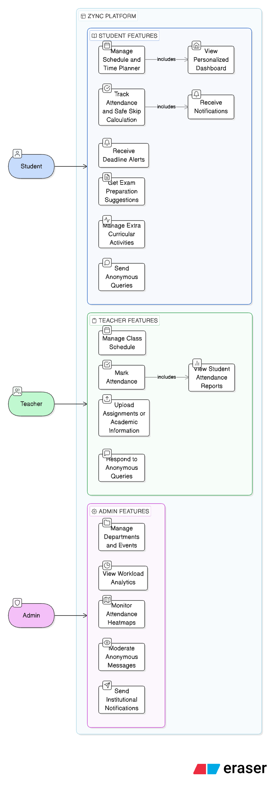

# Use Case Diagram
The Use Case Diagram illustrates the interaction between different user roles and the Zync platform.  
Zync is designed as an intelligent academic life synchronization system that assists students and faculty in managing schedules, attendance, workload, exam preparation, and communication.

The system focuses on personalization, predictive guidance, and balanced academic planning rather than just static information display.

## Actors
- **Student** – Manages schedules, attendance, study plans, extracurricular activities, and communication.
- **Teacher** – Handles academic coordination, attendance marking, and student query responses.
- **Admin** – Oversees institutional analytics, moderation, and event management.

## Diagram

